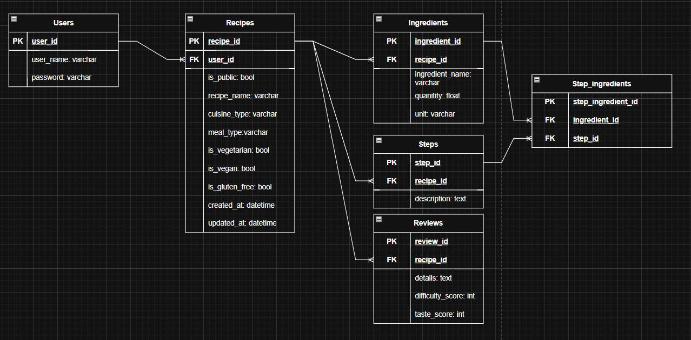

# WORK IN PROGRESS!!
# OpenRecipeDatabase
Although there already exist Open Source Recipe Database software, I plan on creating a version that allows for Optical Character Recognition and searching by ingredients used, rather than by recipe.  
## To Do
- Test Create Account
- Create functionality to authenticate user using jwt tokens?
- Create functionality to create recipe
## Tech Stack
- Frontend: React
- Backend: Node.js
- Database: PostGreSQL

## ERD

## Licence
Currently GNU GPL v3, may be subject to change to any later version as published by the Free Software Foundation (SPDX license identifier GPL-3.0-or-later) 
